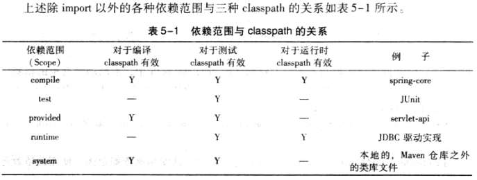
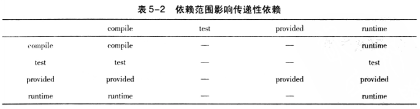
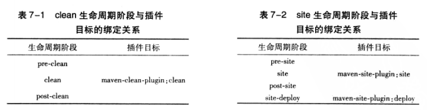
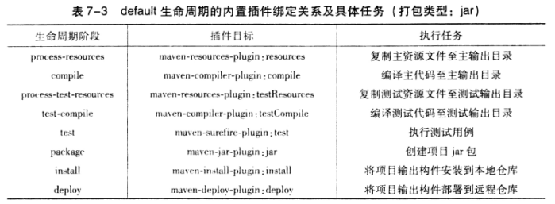

## 2.3.2 .m2

```
mvn help:system #打印所有的java系统属性和环境变量
```

## 2.4 设置HTTP代理

```
 <proxies>
    <proxy>
      <id>my-proxy</id>
      <active>true</active>
      <protocol>http</protocol>
      <host>x.x.x.x</host>
      <port>1080</port>
      <!--当代理服务需要认证时需配
      <username></username>
      <password></password>
      指定哪些主机不需要代理，这里支持|和*
      <nonProxyHosts>localhost|127.0.0.1</nonProxyHosts>
      -->  
    </proxy>
 </proxies>

```

## 2.7 Maven安装最佳实践
#### 2.7.1 设置MAVEN_OPTS环境变量
1. mvn实际执行的是Java命令，所以可以通过设置MAVEN_OPTS环境变量设置Java命令的参数
2. 由于Java默认最大可用内存比较小，通常设置MAVEN_OPTS值为-Xms128m -Xmx512m
3. 尽量修改环境变量，别直接在mvn脚本中改，因为maven一升级就得重新设置

#### 2.7.2 配置用户范围settings.xml
1. $MAVEN_HOME/conf/settings.xml全局的
2. ~/.m2/settings.xml用户的（推荐）便于升级

#### 2.7.3 不要使用IDE中的MAVEN

## 3.1 编写POM

```
<?xml version="1.0" encoding="UTF-8"?>
<project xmlns="http://maven.apache.org/POM/4.0.0" xmlns:xsi="http://www.w3.org/2001/XMLSchema-instance"
         xsi:schemaLocation="http://maven.apache.org/POM/4.0.0 http://maven.apache.org/maven-v4_0_0.xsd">
        <modelVersion>4.0.0</modelVersion> 
        <groupId>pers.liy.helloworld</groupId>
        <artifactId>hello-world</artifactId>
        <version>1.0-SNAPSHOT</version>
        <name>Maven Hello World Project</name>
</project>

```
1. modelVersion：pom模型的版本，Maven2和Maven3是4.0.0
2. 坐标：groupId、artifactId、version
3. groupId：项目属于哪个组，eg，googlecode公司的myapp项目就是com.googlecode.myapp
4. artifactId：当前项目在组中的唯一ID
5. version：当前项目的版本
6. SNAPSHOT：快照，说明该项目还处在开发中，不稳定
7. name：项目名称，非必须，推荐写
8. pom稳定后日常开发基本不涉及修改pom

## 3.2 编写主代码
```
package pers.liy.helloworld;

public class HelloWorld {

    public String sayHello() {
        return "Hello world!";
    }

    public void main(String[] args) {
        System.out.println(new HelloWorld().sayHello());
    }
}

```
1. src/main/java目录，maven约定会自动搜寻该目录找到项目主代码
2. 包名应与groupId吻合
3. mvn clean compile编译
4. clean是删除target/
5. clean:clean、resources:resources、compiler:compile对应一些Maven插件:目标

## 3.3 编写测试代码
1. src/test/java目录，maven中默认测试代码目录
2. 添加JUnit依赖
```
<?xml version="1.0" encoding="UTF-8"?>
<project xmlns="http://maven.apache.org/POM/4.0.0" xmlns:xsi="http://www.w3.org/2001/XMLSchema-instance"
         xsi:schemaLocation="http://maven.apache.org/POM/4.0.0 http://maven.apache.org/maven-v4_0_0.xsd">
    <modelVersion>4.0.0</modelVersion>
	<groupId>pers.liy.helloworld</groupId>
	<artifactId>hello-world</artifactId>
    <version>1.0-SNAPSHOT</version>
    <name>Maven Hello World Project</name>

    <dependencies>
        <groupId>junit</groupId>
        <artifactId>junit</artifactId>
        <version>4.7</version>
        <scope>test</scope>
    </dependencies>
</project>

```
3. maven自动从中央仓库下载依赖：http://repo1.maven.org/maven2/
4. scope为依赖范围，若依赖范围为test表示只对测试生效。也就是说，在测试代码中import JUnit代码完全没问题，但在主代码中import JUnit就会编译出错。
5. scope默认是compile，表示对主代码和测试代码都有效
```
package pers.liy.helloworld;

import static org.junit.Assert.assertEquals;
import org.junit.Test;

public class HelloWorldTest {
    @Test
    public void testSayHello() {
        HelloWorld helloWorld = new HelloWorld();
        String result = helloWorld.sayHello();
        assertEquals("Hello maven!", result);
    }
}

```
6. mvn clean test
7. surefire是maven中负责执行测试的插件

## 3.4 打包与运行
1. pom中没有指定打包类型，使用默认打包类型jar
2. mvn clean package进行打包
3. jar:jar就是jar插件的jar目标将项目主代码打成artifact-version.jar输出到target/目录下
4. mvn clean install让其他maven项目直接能引用这个jar包
5. install:install将刚打包的jar安装到本地maven仓库中，其他项目才能使用它
6. 默认mvn clean package打包的jar没有把main方法的类信息打到manifest中，不可执行
7. 为了生成可执行的jar文件，需要用maven-shade-plugin
```
<?xml version="1.0" encoding="UTF-8"?>
<project xmlns="http://maven.apache.org/POM/4.0.0" xmlns:xsi="http://www.w3.org/2001/XMLSchema-instance"
    xsi:schemaLocation="http://maven.apache.org/POM/4.0.0 http://maven.apache.org/maven-v4_0_0.xsd">
    <modelVersion>4.0.0</modelVersion>
    <groupId>pers.liy.helloworld</groupId>
    <artifactId>hello-world</artifactId>
    <version>1.0-SNAPSHOT</version>
    <name>Maven Hello World Project</name>

    <dependencies>
        <dependency>
            <groupId>junit</groupId>
            <artifactId>junit</artifactId>
            <version>4.7</version>
            <scope>test</scope>
        </dependency>
    </dependencies>
    <build>
        <plugins>
            <plugin>
                <groupId>org.apache.maven.plugins</groupId>
                <artifactId>maven-shade-plugin</artifactId>
                <version>3.2.1</version>
                <configuration>
                    <transformers>
                        <transformer implementation = "org.apache.maven.plugins.shade.resource.ManifestResourceTransformer">
                            <mainClass>pers.liy.helloworld.HelloWorld</mainClass>
                        </transformer>
                    </transformers>
                </configuration>
                <executions>
                    <execution>
                        <phase>package</phase>
                        <goals>
                            <goal>shade</goal>
                        </goals>
                    </execution>
                </executions>
            </plugin>
        </plugins>
    </build>
</project>

```
8. mvn clean package之后在jar包中的META-INF/MANIFEST.MF中多了
```
Main-Class: pers.liy.helloworld.HelloWorld
```

## 3.5 Archetype生成项目骨架
1. maven3运行mvn archetype:generate
2. maven2运行mvn org.apache.maven.plugins:maven-archetype-plugin:2.0-alpha-5:generate。
3. 因为maven2直接运行mvn archetype:generate不安全，没有指定版本，会自动现在最新版本，可能将不稳定的SNAPSHOP下载下来导致运行失败。maven3中自动下载最新稳定版本，因此安全。
4. 格式含义是wgroupId:artifactId:version:goal
5. 注意执行mvn archetype:generate会从国外网站下载资源，需要配置国外代理

## 4 背景案例
注册系统（略）


# 5 坐标和依赖

## 5.1 何为坐标
1. maven坐标元素：groupId， artifactId, version, packaging, classifier
2. maven从内置的中央仓库下载构建：http://repo1.maven.org/maven2.
3. Maven强制要求，在自己开发项目时也要定义适当的坐标
4. groupId: 当前maven项目隶属的实际项目
- maven项目和实际项目可能不是一一对应，有可能是实际项目的子集。比如，SpringFramework实际项目对应对maven项目有很多如spring-core、springspring-context等
- groupId不应对应隶属的组织和公司
- groupId表示方式与java包名leisi类似，与域名反向一一对应
5. artifactId: 实际项目中的一个maven项目（模块）
- 推荐使用实际项目名称作为artifaceId的前缀
- 默认，maven生成的构建会以artifactId开头
6. version: maven项目当前所处的版本
7. packaging: 打包方式
- 与生成的文件扩展名对应
- 打包方式不同会影响构建的生命周期，比如war和jar打包会使用不同的命令
- 默认使用jar打包方式
8. classifier：帮助定义构建输出的一些附属构件
- 附属构件与主构件对应
- eg：主构件-javadoc.jar, 主构件-sources.jar这样的附属构件，这时，javadoc和sources就是这两个附属构件的classifier
- 不能直接定义项目的classifier，因需要附加插件帮助生成的
9. groupId， artifactId, version是必须定义的，packaging是可选的（默认jar）， classifier是不能直接定义的
10. 项目构件的文件名与坐标对应：artifactId-version[-classifier].packaging

## 5.4 依赖的配置

```
<project>  
  ...  
  <dependencies>  
    <dependency>  
      <groupId>...</groupId>  
      <artifactId>...</artifactId>  
      <version>...</version> 
      <type>...</type>  
      <scope>...</scope> 	
	  <optional>...</optional> 	  
      <exclusions>  
        <exclusion>  
          ...
        </exclusion>  
		...
      </exclusions>  
    </dependency>  
	...
  </dependencies>  
  ...
</project>  
```
1. type：一类的类型，对应于坐标定义时的packaging，默认不必声明，默认为jar
2. scope：依赖的范围
3. optional：标记依赖是否可选
4. exclusions：用来排除传递性依赖

## 5.5 依赖范围
1. maven有三套classpath：编译主代码classpath、测试测试代码classpath、运行项目classpath
2. 依赖范围就是用来控制着三种classpath的
3. maven的几种依赖范围：compile、test、provided、runtime、system、import
- compile：默认使用此依赖范围，对三套classpath都有效
- test：只对测试classpath有效，编译主代码和运行项目都无法使勇此类依赖
- provided：对编译、测试classpath有效，运行时无效，如servlet-api
- runtime：对测试、运行classpath有效，编译主代码时无效，如jdbc驱动
- system：classpath关系与provided一致，但必须通过systemPath元素显示地指定依赖文件的路径；不通过maven仓库解析，与本机系统绑定，造成构建的不可移植，慎用！

```
<dependency>  
    <groupId>javax.sql</groupId>  
    <artifactId>jdbc-stdext</artifactId>  
    <version>2.0</version>  
    <scope></scope>  
    <systemPath>${java.home}/lib/rt.jar</systemPath>  
</dependency>  
```

- import(maven2.0.9以上)：不会对三种classpath产生实际影响


## 5.6 传递性依赖

### 5.6.2 依赖范围与传递依赖
1. A依赖B，叫第一直接依赖；B依赖C，叫第二直接依赖；A依赖C叫传递依赖

2. 规律：看第二直接依赖（横坐标）
- compile：传递依赖与第一直接依赖一致
- test：依赖不传递
- provided：只传递第一直接依赖是provided的，传递依赖也是provided
- runtime：与第一直接依赖一致，compile除外

### 5.6.3 依赖调解
1. A->B->C->X(1.0)、A->D-X(2.0)，X都是A的传递依赖，将被解析为哪个版本？
- 第一原则：路径最近优先，看路径长度所以选X(2.0)会被解析
- 第二原则：第一原则优先，长度相等下，在pom中依赖声明顺序靠前者优先

## 5.8 可选依赖
1. A->B、B->X(可选)、B->Y(可选)，如果依赖都是compile的，由于XY是可选的，所以A不会传递依赖XY
2. A->B-X时需要在A的pom里显示声明依赖X
3. 理想情况下是不应该使用可选依赖的

## 5.9 最佳实践
### 5.9.1 排除依赖
1. 本来A->B->C(原生)，但C(官网的不稳定)，想依赖个第三方的C(第三方稳定)，需在A中显示声明依赖C(第三方)

```
<project>  
  <groupId>...</groupId>  
  <artifactId>A</artifactId>  
  <version>...</version>   
  <dependencies>  
    <dependency>  
      <groupId>...</groupId>  
      <artifactId>B</artifactId>  
      <version>...</version> 
	  <optional>...</optional> 	  
      <exclusions>  
        <exclusion>  
          <groupId>...</groupId>  
          <artifactId>C(官网)</artifactId>  
        </exclusion>  
		...
      </exclusions>  
    </dependency>  
	
	<dependency>  
      <groupId>...</groupId>  
      <artifactId>C(第三方)</artifactId>  
      <version>...</version> 
    </dependency>
  </dependencies>  
  ...
</project>  
```

2. 声明exclusion时只需要指定groupId和artifactId

### 5.9.2 归类依赖
1. 比如spring-framework各模块依赖的版本都是一样的，需要个变量替代，避免多处重复修改

```
<project>  
  <groupId>...</groupId>  
  <artifactId>A</artifactId>  
  <version>...</version>   
  
  <properties>
    <springframework.version>2.5.6</springframework.version>
  </properties>
  
  <dependencies>  
    <dependency>  
      <groupId>org.springframework</groupId>  
      <artifactId>spring-core</artifactId>  
      <version>${springframework.version}</version> 
    </dependency>  
	<dependency>  
      <groupId>org.springframework</groupId>  
      <artifactId>spring-beans</artifactId>  
      <version>${springframework.version}</version> 
    </dependency>
  </dependencies>  
</project>  
```

### 5.9.3 优化依赖
1. 应不断优化pom
2. maven会自动解析所有项目的直接依赖和传递性依赖，根据规则正确判断依赖范围，能调节冲突以保证一个构件只有唯一的版本在依赖中存在。这些工作之后，已存在的依赖被称为已解析的依赖（Resolved Dependency）
3. mvn dependency:list查看当前项目已解析依赖
4. mvn dependency:tree查看依赖树
5. mvn dependency:analyze帮助分析当前项目的依赖
- Used undeclared dependencies：使用到但没有显示声明的依赖；有潜在风险，这种依赖是通过依赖传递进来的，当升级直接依赖时，相关传递依赖也会发生变化，可能导致出错，不易察觉；因此应直接显示声明这类依赖
- Unused declared dependencies：未使用但显示声明的依赖；不应直接简单删除其声明，因dependency:analyze只会分析编译主代码和测试代码需要的依赖，一些执行测试和运行时需要的依赖发现不了

# 仓库

## 6.2 仓库的布局
1. 坐标与仓库路径的对应关系：groupId/artifactId/version/artifactId-version.packaging

## 6.3 仓库的分类
1. 两类： 本地仓库、远程仓库（中央仓库、私服、其他仓库）
2. maven根据坐标首先查找本地仓库、本地没有去远程仓库查找，找到构件之后下载到本地仓库，如果都没有则报错
3. 中央仓库：是默认的远程仓库，包含了绝大部分构建
4. 私服：局域网架设的私有仓库服务器，用其代理所有的远程仓库，节省时间
5. 其他公共库：如 repository.jboss.com/maven2/等

### 6.3.1 本地仓库
1. 自定义本地仓库地址~/.m2/settings.xml
<settings>
    <localRepository>...</localRepository>
</settings>
2. 构建进入本地仓库两种方式：从远程仓库下载、mvn clean install安装到本地仓库
3. 刚装好maven后本地仓库是不存在的，只有输入第一条命令之后才会创建本地仓库

### 6.3.2 中央仓库
1. maven安装自带中央仓库配置，$M2_HOME/lib/maven-model-builder-3.0.jar中org/apache/maven/model/pom-4.0.0.xml配置
```
<project>  
    ...
    <repositories>
    	<repository>
    	  <id>jboss</id>
    	  <name>Maven Repository Switchboard</name>
    	  <url>http://repo1.maven.org/maven2</url>
    	  <layout>default</layout>
    	  <snapshots>
    		<enabled>false</enabled>
    	  </snapshots>
    	</repository>
    </repositories>
    ...
</project>  
```
这个pom文件是所有maven项目都会继承的，snapshots为false表示不从该中央仓库下载快照版的构件

## 6.3.3 私服
1. 局域网内相当于本地仓库与远程仓库之间的缓存
2. 即使在一台可以连入互联网的个人机器上使用maven，也应在本地建立私服
- 节省自己外网带宽
- 加速maven构建
- 部署第三方构件
- 提高稳定性，增强控制
- 降低中央仓库负荷
3. 最流行的maven私服软件Nexus

## 6.4 远程仓库的配置
1. 有时默认的中央仓库无法满足项目需求，可以自己在pom中配置远程仓库
```

<repositories>
	<repository>
	  <id>jboss</id>
	  <name>JBoss Repository</name>
	  <url>http://repository.jboss.org/maven2/</url>
	  <layout>default</layout>
	  <releases>
	    <enabled>true</enabled>
	  </releases>
	  <snapshots>
		<enabled>false</enabled>
	  </snapshots>
	</repository>
</repositories>
```
- 中央仓库id是central，其他远程仓库id如果也是这个就会覆盖，id应唯一
- releases是true，开启发布版本下载支持
- snapshots是false，关闭快照版本下载支持
- layout是仓库布局，maven2、maven3是default
- releases、snapshots子元素除了enabled，还有updatePolicy和checkSumPolicy
```
<snapshots>
    <enabled>false</enabled>
    <updatePolicy>daily</updatePolicy>
    <checkSumPolicy>ignore</checkSumPolicy>
</snapshots>
```
- updatePolicy: 从远程仓库检查更新的频率；daily-每天检查一次；never-从不检查更新；always-每次构建都检查更新；interval: X-每隔X分钟检查一次
- checkSumPolicy：配置检查校验和文件的策略；warn-构建时数据警告信息（默认）；fail-遇到校验和错误就让构建失败；ignore-完全忽略校验和错误

### 6.4.1 远程仓库的认证
1. 远程仓库可以配置在pom中，但认证信息必须配置在setting.xml中
```
<settings>
    <servers>
        <server>
          <id>deploymentRepo</id>
          <username>repouser</username>
          <password>repopwd</password>
        </server>
    </servers>
</settings>
```

### 6.4.2 部署到远程仓库
```
<project>
    ...
    <distributionManagement>
        <repository>
            <id>proj-releases</id>
            <name>proj repo</name>
            <url>http://172.17.103.59:8081/nexus/content/repositories/releases/</url>
        </repository>
        <snapshotRepository>
            <id>proj-snapshots</id>
            <name>proj repo</name>
            <url>http://172.17.103.59:8081/nexus/content/repositories/snapshots/</url>
        </snapshotRepository>
    </distributionManagement>
     ...
</project>
```
- repository：发布版本构件的仓库
- snapshotRepository：快照版本的仓库
- 远程仓库一般需要认证，在settings.xml中配置
1. mvn clean deploy就会将构件部署到配置对应的远程仓库

### 6.5 快照版本

1. 设定为2.1-SNAPSHOP后，在发布过程中，maven会自动为构件打上时间戳。比如：2.1-20091214.221414-13，表示2009年12月14号22点14分14秒第13次快照
2. 有了时间戳，maven每次就能找到最新的SNAPSHOP了
3. mvn clean install -U强制让maven检查更新
4. 快照版本只应在组织内部的项目或模块间依赖使用
5. 项目不应依赖任何组织外的快照版本

### 6.6 从仓库解析依赖的机制

1. RELEASE和LATEST版本是根据groupId/artifactId/maven-metadata.xml计算出来的
2. 在依赖声明中使用RELEASE和LATEST版本是不推荐的，随时会解析到不同的构件，且maven不会告知这些变化
3. 仓库元数据不是永远正确

## 6.7 镜像
1. 如果仓库X能提供仓库Y的所有内容，X是Y的一个镜像
2. 比如http://maven.aliyun.com/nexus/content/groups/public/就是中央仓库o1.maven.org在中国的镜像
3. 在settings.xml配置
```
<settings>
    <mirrors>
        <mirror>  
          <id>alimaven</id>  
          <name>aliyun maven</name>  
          <url>http://maven.aliyun.com/nexus/content/groups/public/</url>  
          <mirrorOf>central</mirrorOf>          
        </mirror> 
    </mirrors>
</settings>
```
- mirrorOf为central表示中央仓库的镜像，任何对中央仓库的请求都会转至该镜像
4. 镜像的高级配置
- <mirrorOf>*</mirrorOf>：匹配所有远程库
- <mirrorOf>external:*</mirrorOf>：匹配所有远程库，使用localhost、file://协议的除外，即匹配所有不在本机上的远程库
- <mirrorOf>repo1,repo2</mirrorOf>：匹配repo1和repo2
- <mirrorOf>*,! repo1</mirrorOf>：匹配所有，repo1除外

## 6.8 仓库搜索服务

### 6.8.1 Sonatype Nexus
1. nexus：http://repository.sonatype.org/
2. jarvana：http://www.jarvana.com/jarvana/
3. MVNbrowser：http://www.mvnbrowser.com
4. MVNrepository：http://mvnrepository.com


# 7 生命周期和插件

## 7.1 何为声明周期
1. 声明周期是抽象的，具体工作有插件完成，一般有默认插件

## 7.2 生命周期详解

### 7.2.1 三套声明周期
1. maven拥有三套相互独立的声明周期：clean、default、site
- clean：清理项目
- default：构建项目
- site：建立项目站点
2. 阶段phase：每个生命周期都是有顺序的，后面的phase依赖前面的phase都执行
3. 三套生命周期是相互独立的、互不影响

### 7.2.2 clean生命周期
1. 清理项目
- pre-clean
- clean
- post-clean

### 7.2.3 default声明周期
1. 真正构建时需要执行的步骤
- validate
- initialize
- generate-sources
- process-sources
- generate-resources
- process-resources
- compile：编译项目主源码src/main/java下的java文件至项目输出到主classpath中
- process-classes
- generate-test-sources
- process-test-sources
- generate-test-resources
- process-test-resources
- test-compile：编译项目的测试代码src/test/java下的java文件至项目输出到测试classpath中
- process-test-classes
- test：使用单元测试框架运行测试
- prepare-package
- package
- pre-integration-test
- integration-test
- post-integration-test
- verify
- install：将包安装到本地仓库，供其他项目使用
- deploy：将最终包复制到远程仓库

2. 了解详情请去 https://maven.apache.org/guides/introduction/introduction-to-the-lifecycle.html

### 7.2.4 site声明周期
1. 目的是建立和发布站点
- pre-site
- site：生成站点文档
- post-site
- site-deploy：将生成的项目站点发布到服务器上

### 7.2.5 命令行与生命周期
1. 各声明周期是相互独立的，同声明周期阶段有前后依赖关系
2. 比如 mvn clean install 执行了clean、default两个阶段

## 7.3 插件目标
1. maven会在需要的时候下载并使用插件
2. 插件目标（plugin goal）:对应一个功能
3. 比如插件maven-dependency-plugin的插件目标有很多如dependency:analyze、dependency:tree，插件前缀:插件目标

## 7.4 绑定插件

### 7.4.1 内置绑定





### 7.4.2 自定义绑定

1. 写法
```
<build>
	<plugins>
		<plugin>
			<groupId>org.apache.maven.plugins</groupId>
			<artifactId>maven-source-plugin</artifactId>
			<version>2.1.1</version>
			<executions>
				<execution>
					<id>attach-sources</id>
					<phase>verify</phase>
					<goals>
						<goal>jar-no-fork</goal>
					</goals>
				</execution>
			</executions>
		</plugin>
		...
	</plugins>
</build>
```
mvn verify就会执行这个插件了
2. mvn help:describe -Dplugin=groupId:artifactId:version 输出插件的详情
3. 当多个插件绑定到同一阶段，按这些插件声明顺序先后执行

## 7.5 配置插件

### 7.5.1 命令行插件配置
1. 命令 -D key=value方式，如mvn install -Dmaven.test.skip=true

### 7.5.2 pom中插件全局配置
1. 在<plugin>中<configuration>

### 7.5.3 pom中插件任务配置
```
<build>
<plugins>
...
<plugin>
<executions>
<execution>
<configuration>
```

## 7.6 获取插件信息    

1. 基本所有maven插件都来自Apache和Codehaus
2. https://maven.apache.org/plugins/
3. https://www.mojohaus.org/plugins.html
4. 常用插件附录C
5. mvn help:describe
- mvn help:describe -Dplugin=groupId:artifactId:version查看插件信息
- mvn help:describe -Dplugin=compiler
- mvn help:describe -Dplugin=compiler -Dgoal=compile
- mvn help:describe -Dplugin=compiler -Ddetail

## 7.7 从命令行调用插件   

1. mvn [options] [<goal(s)>] [<phase(s)>]
- goal：插件目标，mvn支持从命令行调用插件目标
- phase：声明周期

## 7.8 maven插件机制
1. mvn help:system help怎么找到对应的插件org.apache.maven.plugins:maven-help-plugin的

2. 插件根据坐标先找本地仓库找，没有再去远程仓库找
3. maven区别对待依赖的远程仓库、插件远程仓库
4. 插件远程仓库使用pluginRepositorys和pluginRepository配置，而不使用repositorys和repository
5. 插件的远程仓库配置方式
```
<project>
...
  <repositories>
    <repository>
      <id>maven-net-cn</id>
      <name>Maven China Mirror</name>
      <url>http://maven.net.cn/content/groups/public/</url>
      <releases>
        <enabled>true</enabled>
      </releases>
      <snapshots>
        <enabled>false</enabled>
      </snapshots>
    </repository>
  </repositories>
  <pluginRepositories>
    <pluginRepository>
      <id>maven-net-cn</id>
      <name>Maven China Mirror</name>
      <url>http://maven.net.cn/content/groups/public/</url>
      <releases>
        <enabled>true</enabled>
      </releases>
      <snapshots>
        <enabled>false</enabled>
      </snapshots>    
    </pluginRepository>
  </pluginRepositories>
...
</project>
```
6. 一般中央仓库包含的插件能完全满足我们的需求，因此也不需要配置其他的插件仓库，也可以在settings.xml中加入
7. 插件默认groupId是org.apache.maven.plugins，可以省略写，但不推荐这样
8. 超级pom是所有maven项目的父pom
9. 由于有超级pom，有一有一些默认插件比如maven-clean-plugin、maven-compiler-plugin等
10. maven3中当用户没写version时，直接用最新的release，但仍有潜在危险，应该显示设定版本
11. 插件前缀与插件坐标groupId:artifactId是一一对应的，这种匹配关系存在仓库元数据中


# 8 聚合和集成

## 8.2 聚合
1. 聚合的是项目中的各个模块，各个模块有自己的pom
2. groupId、version与子模块一直，artifactId自己定义，packaging值为pom，name随意起便于阅读
3. 聚合的关键是<modules>
```
<modules>
    <module>sub-a</module>
    <module>sub-b</module>
</modules>
```
4. sub-a、sub-b是父pom的相对路径的字模块文件夹
5. 聚合目录与其他子模块目录并非一定要父子关系，平行目录需要如下
```
<modules>
    <module>../sub-a</module>
    <module>../sub-b</module>
</modules>
```

## 8.3 继承

1. 通过继承去除pom中的重复
2. 继承的父pom中，packaging也必须是pom
3. 父pom就是帮助消除重复，所以不需要src/main/java/之类的文件夹了
4. 父模块写法
```
<?xml version="1.0" encoding="UTF-8"?>  
<project xmlns="http://maven.apache.org/POM/4.0.0" xmlns:xsi="http://www.w3.org/2001/XMLSchema-instance"  
xsi:schemaLocation="http://maven.apache.org/POM/4.0.0 http://maven.apache.org/maven-v4_0_0.xsd">  
    <modelVersion>4.0.0</modelVersion>  
    <groupId>com.juvenxu.mvnbook.account</groupId>  
    <artifactId>account-parent</artifactId>  
    <version>1.0.0-SNAPSHOT</version>  
    <packaging>pom</packaging>  
    <name>Account Parent</name>     
</project> 

```
继承父pom的子pom写法
```
<?xml version="1.0" encoding="UTF-8"?>  
<project xmlns="http://maven.apache.org/POM/4.0.0" xmlns:xsi="http://www.w3.org/2001/XMLSchema-instance"  
xsi:schemaLocation="http://maven.apache.org/POM/4.0.0 http://maven.apache.org/maven-v4_0_0.xsd">  
    <modelVersion>4.0.0</modelVersion> 
    <parent>
        <groupId>com.juvenxu.mvnbook.account</groupId>  
        <artifactId>account-parent</artifactId>  
        <version>1.0.0-SNAPSHOT</version>  
        <relativePath>../account-parent/pom.xml</relativePath>  
    </parent> 
    <artifactId>account-email</artifactId> 
    <name>Account Email</name> 

    <dependencies>
            ......
    </dependencies>

    <build>
            <plugins>
                ......
            </plugins>
    </build>
</project>

```
5. 子模块隐式继承了父pom的groupId、version，如果子模块有自己的也可显示声明
6. artifactId不能继承自父pom
7. 最后在聚合模块中加上父模块
```
<?xml version="1.0" encoding="UTF-8"?>  
<project xmlns="http://maven.apache.org/POM/4.0.0" xmlns:xsi="http://www.w3.org/2001/XMLSchema-instance"  
xsi:schemaLocation="http://maven.apache.org/POM/4.0.0 http://maven.apache.org/maven-v4_0_0.xsd">  
<modelVersion>4.0.0</modelVersion>  
    <groupId>com.juvenxu.mvnbook.account</groupId>  
    <artifactId>account-aggregator</artifactId>  
    <version>1.0.0-SNAPSHOT</version>  
    <packaging>pom</packaging>  
    <name>Account Aggregator</name>  
    <modules>
         <module>account-parent</module>    
         <module>account-email</module>  
    <modules>     
</project> 
```

8. 可继承的pom元素
- groupId
- version
- description
- organization
- inceptionYear
- url
- developers
- contributors
- distributionManagement
- issueManagement
- ciManagement
- scm
- mailingLists
- proterties
- dependencies
- dependencyManagement
- repositories
- build
- reporting

### 8.3.3 依赖管理

1. 解决的是如果把两个模块公用依赖抽出存入共同的parent的pom中，之后所有子pom都会继承这个依赖，这样不合理
2. dependencyManagement元素既能让子模块集成到父模块的依赖配置，又能保证子模块依赖的使用的灵活性
3. dependencyManagement下的依赖声明不会引入实际的依赖，不过它能约束dependencies下的依赖使用
```
<?xml version="1.0" encoding="UTF-8"?>  
<project xmlns="http://maven.apache.org/POM/4.0.0" xmlns:xsi="http://www.w3.org/2001/XMLSchema-instance"  
xsi:schemaLocation="http://maven.apache.org/POM/4.0.0 http://maven.apache.org/maven-v4_0_0.xsd">  
<modelVersion>4.0.0</modelVersion>  
        <groupId>com.juvenxu.mvnbook.account</groupId>  
        <artifactId>account-parent</artifactId>  
        <version>1.0.0-SNAPSHOT</version>  
        <packaging>pom</packaging>  
        <name>Account Parent</name> 
        <properties>
                <springframework.version>2.5.6</springframework.version>
        </properties>

        <dependencyManagement>
                <dependencies>
                       <dependency>
                            <groupId>org.springframework </groupId>
                            <artifactId>spring-core</artifactId>
                            <version>${springframework.version}</version>
                       </dependency>

                       ......

                </dependencies>
        </dependencyManagement>
</project>

```
4. 上面dependencyManagement声明的依赖既不会给account-parent引入依赖，也不会给它的子模块引入依赖，不过这段配置是会被继承
5. 如果子模块不声明依赖的使用，即使该依赖在父模块声明了dependencyManagement也不会生效
```
<?xml version="1.0" encoding="UTF-8"?>  
<project xmlns="http://maven.apache.org/POM/4.0.0" xmlns:xsi="http://www.w3.org/2001/XMLSchema-instance"  
xsi:schemaLocation="http://maven.apache.org/POM/4.0.0 http://maven.apache.org/maven-v4_0_0.xsd">  
<modelVersion>4.0.0</modelVersion> 
        <parent>
            <groupId>com.juvenxu.mvnbook.account</groupId>  
            <artifactId>account-parent</artifactId>  
            <version>1.0.0-SNAPSHOT</version>  
            <relativePath>../account-parent/pom.xml</relativePath>  
        </parent> 
        <artifactId>account-email</artifactId> 
        <name>Account Email</name> 

        <dependencies>
                <dependency>
                    <groupId>org.springframework</groupId>
                    <artifactId>spring-core</artifactId>
                </dependency>
                
                ......
                
        </dependencies>

        <build>
                <plugins>
                    ......
                </plugins>
        </build>

</project>
```

### 8.3.4 插件管理
1. pluginManagement的父pom中
```
<build>
    <pluginManagement>
        <plugins>
            <plugin>
            <groupId>org.apache.maven.plugins</groupId>
            <artifactId>maven-source-plugin</artifactId>
            <version>2.1.2</version>
            <executions>
              <execution>
                <id>attach-sources</id>
                <phase>verify</phase>
                <goals>
                  <goal>jar-no-fork</goal>
                </goals>
              </execution>
            </executions>
            </plugin>
        </plugins>
    </pluginManagement>
</build>
```
在子模块中继承pluginManager后的插件配置
```
  <build>
      <plugins>
          <plugin>
            <groupId>org.apache.maven.plugins</groupId>
            <artifactId>maven-source-plugin</artifactId>
          </plugin>
        </plugins>
  </build>
```
2. 正确的方式是把所有插件都放在父pluginManagement中，统一在父pom中配置版本，子模块中不配置版本信息

## 8.4 聚合与继承关系
1. 聚合：方便快速构建项目，继承：消除重复配置
2. 一般项目pom既是聚合pom又是父pom，融合使用聚合继承没问题
3. 共同点是packaging都是pom

## 8.5 约定优于配置
1. 约定可以大量减少配置
2. maven3超级pom在$MAVEN_HOME/lib/maven-model-builder-x.x.x.jar中的org//apache/maven/model/pom-4.0.0.xml路径下
3. maven约定都是在超级pom中配置的
```
<?xml version="1.0" encoding="UTF-8"?>

<!--
Licensed to the Apache Software Foundation (ASF) under one
or more contributor license agreements.  See the NOTICE file
distributed with this work for additional information
regarding copyright ownership.  The ASF licenses this file
to you under the Apache License, Version 2.0 (the
"License"); you may not use this file except in compliance
with the License.  You may obtain a copy of the License at

    http://www.apache.org/licenses/LICENSE-2.0

Unless required by applicable law or agreed to in writing,
software distributed under the License is distributed on an
"AS IS" BASIS, WITHOUT WARRANTIES OR CONDITIONS OF ANY
KIND, either express or implied.  See the License for the
specific language governing permissions and limitations
under the License.
-->

<!-- START SNIPPET: superpom -->
<project>
  <modelVersion>4.0.0</modelVersion>

  <repositories>
    <repository>
      <id>central</id>
      <name>Central Repository</name>
      <url>https://repo.maven.apache.org/maven2</url>
      <layout>default</layout>
      <snapshots>
        <enabled>false</enabled>
      </snapshots>
    </repository>
  </repositories>

  <pluginRepositories>
    <pluginRepository>
      <id>central</id>
      <name>Central Repository</name>
      <url>https://repo.maven.apache.org/maven2</url>
      <layout>default</layout>
      <snapshots>
        <enabled>false</enabled>
      </snapshots>
      <releases>
        <updatePolicy>never</updatePolicy>
      </releases>
    </pluginRepository>
  </pluginRepositories>

  <build>
    <directory>${project.basedir}/target</directory>
    <outputDirectory>${project.build.directory}/classes</outputDirectory>
    <finalName>${project.artifactId}-${project.version}</finalName>
    <testOutputDirectory>${project.build.directory}/test-classes</testOutputDirectory>
    <sourceDirectory>${project.basedir}/src/main/java</sourceDirectory>
    <scriptSourceDirectory>${project.basedir}/src/main/scripts</scriptSourceDirectory>
    <testSourceDirectory>${project.basedir}/src/test/java</testSourceDirectory>
    <resources>
      <resource>
        <directory>${project.basedir}/src/main/resources</directory>
      </resource>
    </resources>
    <testResources>
      <testResource>
        <directory>${project.basedir}/src/test/resources</directory>
      </testResource>
    </testResources>
    <pluginManagement>
      <!-- NOTE: These plugins will be removed from future versions of the super POM -->
      <!-- They are kept for the moment as they are very unlikely to conflict with lifecycle mappings (MNG-4453) -->
      <plugins>
        <plugin>
          <artifactId>maven-antrun-plugin</artifactId>
          <version>1.3</version>
        </plugin>
        <plugin>
          <artifactId>maven-assembly-plugin</artifactId>
          <version>2.2-beta-5</version>
        </plugin>
        <plugin>
          <artifactId>maven-dependency-plugin</artifactId>
          <version>2.8</version>
        </plugin>
        <plugin>
          <artifactId>maven-release-plugin</artifactId>
          <version>2.5.3</version>
        </plugin>
      </plugins>
    </pluginManagement>
  </build>

  <reporting>
    <outputDirectory>${project.build.directory}/site</outputDirectory>
  </reporting>

  <profiles>
    <!-- NOTE: The release profile will be removed from future versions of the super POM -->
    <profile>
      <id>release-profile</id>

      <activation>
        <property>
          <name>performRelease</name>
          <value>true</value>
        </property>
      </activation>

      <build>
        <plugins>
          <plugin>
            <inherited>true</inherited>
            <artifactId>maven-source-plugin</artifactId>
            <executions>
              <execution>
                <id>attach-sources</id>
                <goals>
                  <goal>jar-no-fork</goal>
                </goals>
              </execution>
            </executions>
          </plugin>
          <plugin>
            <inherited>true</inherited>
            <artifactId>maven-javadoc-plugin</artifactId>
            <executions>
              <execution>
                <id>attach-javadocs</id>
                <goals>
                  <goal>jar</goal>
                </goals>
              </execution>
            </executions>
          </plugin>
          <plugin>
            <inherited>true</inherited>
            <artifactId>maven-deploy-plugin</artifactId>
            <configuration>
              <updateReleaseInfo>true</updateReleaseInfo>
            </configuration>
          </plugin>
        </plugins>
      </build>
    </profile>
  </profiles>

</project>
<!-- END SNIPPET: superpom -->

```

## 8.6 反应堆

1. 反应堆（Reactor）：所有模块组成的一个构建结构
2. 单模块项目：反应堆就是它本事
3. 多模块项目：反应堆包含各模块之间继承与依赖的关系，从而自动计算出模块构建顺序

### 8.6.1 反应堆构建顺序
1. 反应堆pom
```
<modules>  
  <module>account-email</module>  
  <module>account-persist</module>  
  <module>account-parent</module>  
</modules>  
```
2. 构建顺序是：account-aggregator、account-parent、account-email、account-persist
3. 如果构建时发现pom中有依赖，就先构建依赖的模块
4. 因此当出现A依赖B，B又依赖A时，构建报错

### 8.6.2 裁剪反应堆

- -am, --also-make：同时构建所列模块的依赖模块
- -amd, -also-make-dependents：同时构建依赖于所列模块的模块
- -pl, --projects <args>：构建指定模块，模块间用逗号间隔
- -rf, --resume-from <args>：从指定模块回复反应堆