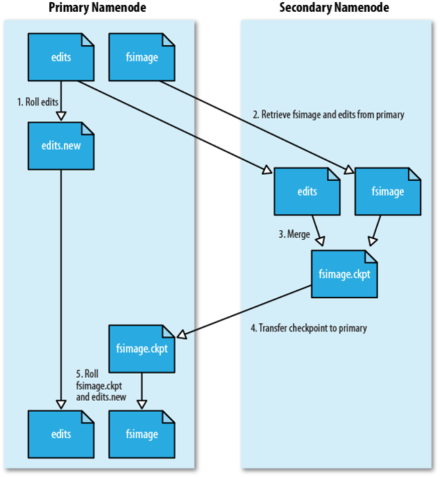
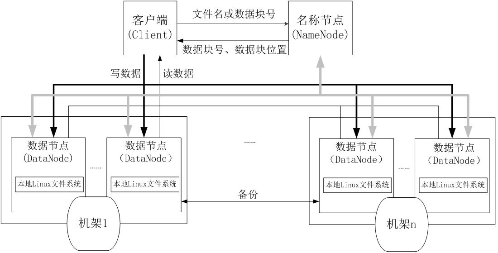
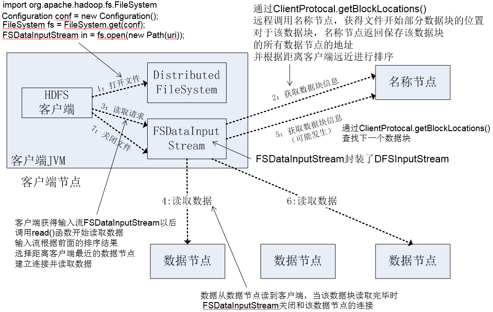
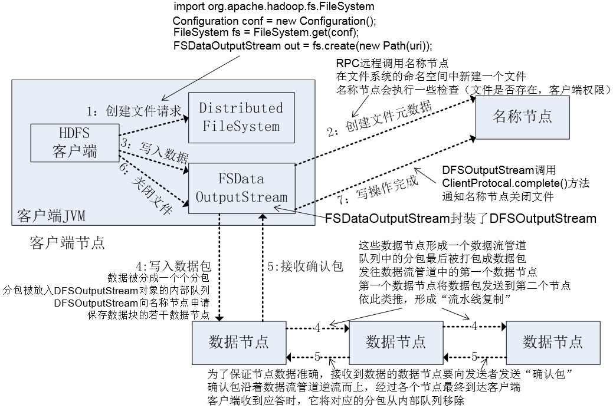

# 分布式文件系统HDFS
> **作者：liy**

## 分布式文件系统的结构
- 主节点（Master Node）,又叫名称节点（NameNode）
- 从节点（Slave Node），又叫数据节点（DataNode）

## HDFS要实现以下目标及优势
- 兼容廉价的硬件设备
- 流数据读写：传统文件系统是一部分一部分读写，HDFS是全部读写，满足海量数据处理
- 大数据集：几百兆-好几TB的文件，大部分是管理好几TB文件
- 简单的文件模型：只允许追加，不允许修改
- 强大的跨平台兼容性：java写的，跨平台

## HDFS局限性
- 不适合低延迟数据访问：因为流式读写，不能返回实时的处理需求
- 无法高效存储大量小文件：HDFS通过NameNode内存检索的，不能分太小
- 不支持多用户写入及任意修改文件

## 块
- 默认一块64M，一个文件被分成多个块，以块为单位存储
- 块远大于普通文件系统，可最小化寻址开销
- 但块也不是越大越好，MapReduce处理数据是根据块的，块大MapRedeuce并行度降低
- 好处：
1. **支持大规模文件存储**：文件块可以被分发到不同的节点上，因此，文件大小不会受单个节点的存储容量的限制，可以远远大于网络中任意节点的存储容量
2. **简化系统设计**：简化存储管理，文件块大小是固定的，容易计算出一个节点可以存储多少文件块；方便元数据的管理，元数据不需要和文件块一起存储，可由其他系管理元数据
3. **适合数据备份**：每个文件块都可以冗余存储到多个节点上，大大提高了系统的容错性和可用性

## 名称节点
#### NameNode
- 存元数据
- 元数据存在内存中
- 保存文件block-datanode之间的映射
- metadata: File.txt = BlkA:DN1,DN5,DN6; BlkB:DN7,DN1,DN2; BlkC:DN7,DN3,DN9

#### 名称节点的数据结构
- FsImage：维护文件系统树以及文件树中所有的文件和文件夹的元数据
- EditLog：记录了所有针对文件的创建、删除、重命名等操作

###### FsImage文件
- FsImage文件包含：文件系统中所有目录、文件inode的序列化形式
- inode是一个文件或目录的元数据的内部表示，并包含此类信息：文件的复制等级、修改和访问时间、访问权限、块大小以及组成文件的块
- FsImage文件没有记录块存储在哪个数据节点，而是由名称节点把这些映射保留在内存中

#### 名称节点的启动
1. FsImage加载到内存
2. 执行EditLog中各项操作，使内存中元数据和实际的同步
3. 将同步后元数据存入新的FsImage中
4. 删除原EditLog，新建一个空的EditLog
5. 之后的操作都写入新的EditLog中，因为一般FsImage一般都很大(GB)，写入它中会很慢

#### 名称节点运行期间EditLog不断变大的问题
- 在名称节点运行期间，HDFS的所有更新操作都是直接写到EditLog中，EditLog文件将会变得很大
- 当名称节点重启的时候，名称节点需要先将FsImage里面的所有内容映像到内存中，然后再一条一条地执行EditLog中的记录，当EditLog文件非常大的时候，会导致名称节点启动操作非常慢，而在这段时间内HDFS系统处于安全模式，一直无法对外提供写操作，影响了用户的使用
- 如何解决？答案是：SecondaryNameNode第二名称节点
- 第二名称节点：它是用来保存名称节点中对HDFS元数据信息的备份，并减少名称节点重启的时间，一般是单独运行在一台机器上

#### SecondaryNameNode的工作机制


1. **NN停写EditLog**：SecondaryNameNode会定期和NameNode通信，请求其停止使用EditLog文件，暂时将新的写操作写到一个新的文件edit.new上来，这个操作是瞬间完成，上层写日志的函数完全感觉不到差别；
2. **GET**：SecondaryNameNode以HTTPGET方式从NameNode上获取到FsImage和EditLog文件
3. **合并**：SecondaryNameNode将下载下来的FsImage载入到内存，然后一条一条地执行EditLog文件中的各项更新操作，使得内存中的FsImage保持最新
4. **POST**：通过post方式将新的FsImage文件发送到NameNode节点上
5. **NN替换**：NameNode将接收的新的FsImage替换旧的FsImage文件，同时将edit.new替换EditLog文件，通过这个过程EditLog就变小了

## 数据节点
#### DataNode
- 存文件内容
- 文件内容保存在磁盘
- 维护block id : datanode本地文件的映射关系

- 数据节点：HDFS的工作节点，负责数据的存储和读取，会根据客户端或者是名称节点的调度来进行数据的存储和检索，并且向名称节点定期发送自己所存储的块列表
- 每个数据节点中的数据会被保存在各自节点的本地Linux文件系统中

## HDFS体系结构概述


- HDFS采用了主从（Master/Slave）结构模型
- 包括一个名称节点（NameNode）和若干个数据节点（DataNode）
- 名称节点作为中心服务器，负责管理文件系统的命名空间、客户端对文件的访问
- 数据节点一般是一个节点运行一个数据节点进程，负责处理文件系统客户端的读/写请求- - 数据节点在名称节点的统一调度下进行数据块的创建、删除和复制等操作
- 每个数据节点的数据实际上是保存在本地Linux文件系统中

## HDFS命名空间管理
- HDFS的命名空间包含目录、文件和块
- HDFS使用的是传统的分级文件体系
- 用户可以像使用普通文件系统一样，创建、删除目录和文件，在目录间转移文件，重命名文件等

## 通信协议
- 所有的HDFS通信协议都是构建在TCP/IP协议基础之上的
- Client-NameNode：主动发起TCP连接，并使用客户端协议交互
- NameNode-DataNode：数据节点协议
- Client-DataNode：RPC，名称节点不会主动发起RPC，而是响应来自客户端和数据节点的RPC请求

## HDFS体系结构的局限性（1.0版本）
- 命名空间的限制：名称节点是保存在内存中的，名称节点能够容纳的对象（文件、块）的个数会受到内存空间大小的限制
- 性能的瓶颈：整个分布式文件系统的吞吐量，受限于单个名称节点的吞吐量
- 隔离问题：由于集群中只有一个名称节点，只有一个命名空间，无法对不同应用程序进行隔离
- 集群的可用性：一旦这个唯一的名称节点发生故障，会导致整个集群变得不可用

## 冗余数据保存
- 作为一个分布式文件系统，为了保证系统的容错性和可用性，HDFS采用了多副本方式对数据进行冗余存储
- 多副本的优点
1. 加快数据传输速度：用户可以并行取冗余数据
2. 容易检查数据错误：相互对照
3. 保证数据可靠性：如果一个副本坏了，会自动复制

## 数据存取策略
#### 数据存放
- 副本1：放置在上传文件的数据节点；如果是集群外提交，则随机挑选一台磁盘不太满、CPU不太忙的节点
- 副本2：放在与第一个副本不同的机架的节点上
- 副本3：与第一个副本相同机架的其他节点上
- 更多副本：随机节点

#### 数据读取
- HDFS提供API可以确定一个数据节点所属的机架ID，客户端也可以调用API获取自己所属的机架ID
- 客户端读取数据时，从名称节点获得数据块不同副本的存放位置列表，列表中包含了副本所在的数据节点
- 调用API来确定客户端和这些数据节点所属的机架ID
- 某个数据块副本的机架ID 和 客户端对应的机架ID 相同时，就优先选择该副本读取数据
- 如果没有发现，就随机选择一个副本读取数据

## 数据错误与恢复
HDFS具有较高的容错性，可以兼容廉价的硬件，它把硬件出错看作一种常态，而不是异常，并设计了相应的机制检测数据错误和进行自动恢复

#### 名称节点出错
- HDFS1.0版本
- 名称节点核心的两大数据结构是FsImage和Editlog，一旦出错，整个HDFS实例失效
- HDFS设置了备份机制（冷备份），把这些核心文件同步复制到备份服务器SecondaryNameNode上
- 当名称节点出错时，根据备份服务器SecondaryNameNode中的FsImage和Editlog数据进行恢复

#### 数据节点出错
- 数据节点定期向名称节点发送 “心跳” 信息，报告自己的状态
- 当数据节点发生故障，或者网络发生断网时，名称节点就无法收到来自一些数据节点的心跳信息，这时，这些数据节点就会被标记为“宕机”，节点上面的所有数据都会被标记为“不可读”，名称节点不会再给它们发送任何I/O请求
- 由于一些数据节点的不可用，会导致一些数据块的副本数量小于冗余因子
- 名称节点定期检查，一旦发现某个数据块的副本数量小于冗余因子，就会启动数据冗余复制，为它生成新的副本
- HDFS和其它分布式文件系统的最大区别就是可以调整冗余数据的位置

#### 数据出错
- 网络传输和磁盘错误等因素，都会造成数据错误
- 客户端在读取到数据后，会采用md5和sha1对数据块进行校验，以确定读取到正确的数据
- 在文件被创建时，客户端就会对每一个文件块进行信息摘录，并把这些信息写入到同一个路径的隐藏文件里面
- 客户端读文件时，先读该信息文件，利用该信息文件对每个读取的数据块进行校验，如果校验出错，客户端就会请求到另外一个数据节点读取该文件块，并且向名称节点报告这个文件块有错误，名称节点会定期检查并且重新复制这个块

## HDFS数据读写过程
#### 读取文件

```
import java.io.BufferedReader;
import java.io.InputStreamReader;
import org.apache.hadoop.conf.Configuration;  
import org.apache.hadoop.fs.FileSystem;
import org.apache.hadoop.fs.Path;
import org.apache.hadoop.fs.FSDataInputStream;
public class Chapter3 {    
    public static void main(String[] args) {
        try {
            Configuration conf = new Configuration();  
            FileSystem fs = FileSystem.get(conf);
            Path filename = new Path(“hdfs://localhost:9000/user/hadoop/test.txt");
            FSDataInputStream is = fs.open(filename);            
            BufferedReader d = new BufferedReader(new InputStreamReader(is));
            String content = d.readLine(); //读取文件一行 
            System.out.println(content);
            d.close(); //关闭文件 
            fs.close(); //关闭hdfs 
        } catch (Exception e) {  
            e.printStackTrace();  
        }  
    }  
}
```


#### 写入文件

```
import org.apache.hadoop.conf.Configuration;  
import org.apache.hadoop.fs.FileSystem;
import org.apache.hadoop.fs.FSDataOutputStream;
import org.apache.hadoop.fs.Path;
 
public class Chapter3 {    
    public static void main(String[] args) { 
        try {
            Configuration conf = new Configuration();  
            FileSystem fs = FileSystem.get(conf);
            byte[] buff = "Hello world".getBytes(); // 要写入的内容 
            String filename = " hdfs://localhost:9000/user/hadoop/test.txt "; //要写入的文件名 
            FSDataOutputStream os = fs.create(new Path(filename));
            os.write(buff,0,buff.length);
            System.out.println("Create:"+ filename); 
        } catch (Exception e) {  
            e.printStackTrace();  
        }  
    }  
}

```

