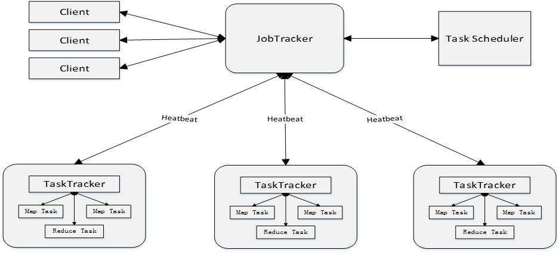

# 大数据处理架构Hadoop
> **作者：liy**

## Hadoop发展简史
- 由Apache Lucene的创始人Doug Cutting开发的文本搜索库
- 起源于2002年Apache Nutch项目---一个开源的网络搜索引擎（Lucene的一部分）
- 2004年，Nutch仿GFS开发自己的分布式文件系统NDFS，HDFS的前身
- 2004年，google发表MapReduce论文
- 2005年，Nutch开源实现了google的MapReduce
- 2006年2月，Nutch中的NDFS和MapReduce独立出来，成Lucene的一个子项目，称Hadoop
- 2008年1月，Hadoop成为Apache顶级项目
- 2008年4月，Hadoop打破世界纪录，最快排1TB的系统，910个节点用209秒
- 2009年5月，缩短至62秒，名声大振，成为大数据处理标准

## Hadoop的特性
- ==高可靠性==
- 高效性
- 高可扩展性
- 高容错性
- 成本低
- 运行在Linux平台上
- 支持多种编程语言

## Hadoop版本演变
- Hadoop一代
1. 三大版本：0.20.x, 0.21.x, 0.22.x
2. 0.20.x--> 1.0.x-->稳定版
3. 0.21.x, 0.22.x增加了NameNode HA
- Hadoop二代
1. 两个版本：0.23.x, 2.x
2. 它们完全不同于Hadoop 1.0，是一套全新的架构，均包含HDFS Federation和YARN两个系统
3. 相比于0.23.x，2.x增加了NameNode HA和Wire-compatibility两个重大特性
- Hadoop1.0 和 Hadoop2.0区别：
1. HDFS: NN Federation、HA
2. MAPREDUCE(cluster resource managemant & data processing) -> YARN(cluster resource managemant) + MAPREDUCE(data processing)

## Hadoop项目结构

1. HDFS：分布式文件系统 Common：最基础服务
2. YARN：资源管理和调度器，内存、CPU等资源
3. MapReduce：分布式并行编程模型，离线计算，批处理，不是实时计算，基于磁盘的
4. Tez：运行在YARN之上的下一代Hadoop查询处理框架，对很多MapReduce作业优化以后构建有向无环图
5. Spark：类似于Hadoop MapReduce的通用并行框架，基于内存计算，快
6. Hive：Hadoop上的数据仓库，用于企业决策分析的，支持SQL语句，会转换成一堆MapReduce作业
7. Pig：一个基于Hadoop的大规模数据分析平台，提供类似SQL的查询语言Pig Latin
8. Ooize：Hadoop上的工作流管理系统
9. Hbase：Hadoop上的非关系型的分布式数据库，实时用的
10. Zookeeper：提供分布式协调一致性服务
11. Ambari：Hadoop快速部署工具，支持Apache Hadoop集群的供应、管理和监控
12. Storm：流计算框架
13. Flume：高可用的，高可靠的，分布式的海量日志采集、聚合和传输的系统
14. Sqoop：用于在Hadoop与传统数据库之间进行数据传递，与关系数据库导入导出
15. Kafka：一种高吞吐量的分布式发布订阅消息系统，可以处理消费者规模的网站中的所有动作流数据

## Hadoop集群中有哪些节点类型
HDFS
- NameNode：负责协调集群中的数据存储，应用先来访问这个节点再去找datanaode
- DataNode：存储被拆分的数据块
- SecondaryNameNode：帮助NameNode收集文件系统运行的状态信息，NameNode的冷备份

MapReduce
- JobTracker：协调数据计算任务
- TaskTracker：负责执行由JobTracker指派的任务

## 节点机器选型

- 在集群中，大部分的机器设备是作为Datanode和TaskTracker工作的

Datanode/TaskTracker | 
---|
4个磁盘驱动器（单盘1-2T），支持JBOD(Just a Bunch Of Disks，磁盘簇)|
2个4核CPU,至少2-2.5GHz |
16-24GB内存 |
千兆以太网 |

- NameNode提供整个HDFS文件系统的NameSpace(命名空间)管理、块管理等所有服务，因此需要更多的RAM，与集群中的数据块数量相对应，并且需要优化RAM的内存通道带宽，采用双通道或三通道以上内存。

NameNode | 
---|
8-12个磁盘驱动器（单盘1-2T）|
2个4核/8核CPU |
16-72GB内存 |
千兆/万兆以太网 |

- SecondaryNameNode在小型集群中可以和NameNode共用一台机器，较大的群集可以采用与NameNode相同的硬件

# Hadoop架构再探讨

## Hadoop的局限与不足
Hadoop1.0的核心组件（仅指MapReduce和HDFS，不包括Hadoop生态系统内的Pig、Hive、HBase等其他组件）
- 抽象层次低，需人工编码：再小的任务都要写底层完整的mapreduce代码
- 表达能力有限：抽象成map、reduce，现实中很多逻辑是不能抽象成map、reduce来实现的
- 开发者自己管理作业（Job）之间的依赖关系：一个大的任务需要多个mapreduce作业完成
- 难以看到程序整体逻辑：只能程序员一行行看代码
- 执行迭代操作效率低：每轮迭代都要计算完存入HDFS
- 资源浪费（Map和Reduce分两阶段执行）：必须先map再reduce，reduce阶段必须等待map阶段
- 实时性差（适合批处理，不支持实时交互式）：批处理的

## Hadoop的改进与提升
- MapReduce和HDFS架构设计的改进
- Hadoop生态其他组件不断丰富，加入Pig、Tez、Spark、Kafka
- 
- 

## HDFS2.0新特性
HDFS HA、HDFS Federation
### HDFS HA
- HDFS1.0存在单点故障问题
- SecondaryNameNode无法解决单点故障问题，主要防止NN中EditLog过大，附带个冷备份功能，所以SecondaryNameNode节点肯定不是备份作用

- HDFS HA为了解决单点故障问题
- HA集群设置两个NN：活跃（Active）和待命（Standby）
- 两个NN的状态（EditLog）同步：共享存储系统(NFS、QJM、Zookeeper)
- 活跃的NN故障，切待命的NN
- Zookeeper选主，确保某一时刻只有一个NN服务
- NN维护映射信息(FsImage)，DN同时向两个NN汇报信息

### HDFS Federation

##### HDFS1.0中存在的问题
- 单点故障问题
- 不可以水平扩展（是否可以通过纵向扩展来解决？）
- 系统整体性能受限于单个名称节点的吞吐量
- 单个名称节点难以提供不同程序之间的隔离性
- HDFS HA是热备份，提供高可用性，但是无法解决可扩展性、系统性能和隔离性

##### HDFS Federation的设计
- 多个相互独立的NN
- 可以水平扩展
- 分别进行各自命名空间和块的管理
- 联盟关系，不需要协调
- 向后兼容
- 所有NN共享底层DN存储资源
- DN向所有NN汇报
- 块池：同一命名空间的块，逻辑的概念

##### HDFS Federation的访问方式
- 对于Federation中的多个命名空间，采用**客户端挂载表**（Client Side Mount Table）方式进行数据共享和访问
- 客户可以访问不同的挂载点来访问不同的子命名空间
- 把各个命名空间挂载到全局“挂载表”（mount-table）中，实现数据全局共享
- 同样的命名空间挂载到个人的挂载表中，就成为应用程序可见的命名空间

##### HDFS Federation相对于HDFS1.0的优势
HDFS Federation设计可解决单名称节点存在的以下几个问题：
- HDFS集群扩展性。多个NN各自分管一部分目录，使得一个集群可以扩展到更多节点，不再像HDFS1.0中那样由于内存的限制制约文件存储数目
- 性能更高效。多个NN管理不同的数据，且同时对外提供服务，将为用户提供更高的读写吞吐率
- 良好的隔离性。用户可根据需要将不同业务数据交由不同NN管理，这样不同业务之间影响很小

需要注意的，HDFS Federation并不能解决单点故障问题，也就是说，每个NN都存在在单点故障问题，需要为每个NN部署一个后备NN(用HA)，以应对NN挂掉对业务产生的影响

## 资源管理调度框架YARN

### MapReduce1.0的缺陷
- 存在单点故障
- JobTracker“大包大揽”导致任务过重（任务多时内存开销大，上限4000节点）
- 容易出现内存溢出（分配资源只考虑MapReduce任务数，不考虑CPU、内存）
- 资源划分不合理（强制划分为slot ，包括Map slot和Reduce slot）
- MapReduce1.0框架图

### YARN设计思路
- MapReduce1.0既是计算框架，又是资源管理调度框架
- Hadoop2.0后，YARN纯粹的资源管理调度框架，MapReduce2.0运行在YARN之上一个纯粹的计算框架
##### Master端
原JobTracker
- 资源管理 ---> ResourceManager
- 任务调度 + 任务监控 ---> ApplicationMaster
##### Slave端
原TaskTracker ---> NodeManager

### YARN体系结构

##### ResourceManager
- 处理客户端请求
- 启动/监控ApplicationMaster：具体执行申请资源
- 监控NodeManager：具体承载资源
- 资源分配与调度

##### ApplicationMaster
- 为应用程序申请资源，并分配给内部任务
- 任务调度、监控与容错
- 某个MapReduce任务所需资源就是ApplicationMaster向ResourceManager申请的

##### NodeManager
- 单个节点上的资源管理，驻守在每个节点上
- 处理来自ResourceManger的命令
- 处理来自ApplicationMaster的命令

#### ResourceManager
- **RM**全局的资源管理器，整个系统的资源管理和分配，包括两组件，即调度器（Scheduler）和应用程序管理器（Applications Manager）
- **调度器**接收ApplicationMaster的应用资源请求，把集群中的资源以“容器”的形式分配给应用，容器的选择根据应用所要处理的数据的位置，就近选择，实现“计算向数据靠拢”
- **容器**（Container）作为动态资源分配单位，每个容器封装一定数量的CPU、内存、磁盘等资源，从而限定每个应用程序可以使用的资源量
- **调度器**是一个可插拔的组件，YARN不仅自身提供了许多种直接可用的调度器，也允许用户根据自己的需求重新设计调度器
- **应用程序管理器**（Applications Manager）负责系统中所有应用程序的管理工作，主要管理ApplicationMaster的，主要包括应用程序提交、与调度器协商资源以启动ApplicationMaster、监控ApplicationMaster运行状态并在失败时重新启动等

#### ApplicationMaster
- ResourceManager接收用户提交的作业，按照作业的上下文信息以及从NodeManager收集来的容器状态信息，启动调度过程，为用户作业启动一个ApplicationMaster
- ApplicationMaster的主要功能是：
    1. 当用户作业提交时，ApplicationMaster与ResourceManager协商获取资源，ResourceManager会以容器的形式为ApplicationMaster分配资源
    2. 把获得的资源进一步分配给内部的各个任务（Map任务或Reduce任务），实现资源的“二次分配”
    3. 与NodeManager保持交互通信进行应用程序的启动、运行、监控和停止，监控申请到的资源的使用情况，对所有任务的执行进度和状态进行监控，并在任务发生失败时执行失败恢复（即重新申请资源重启任务）
    4. 定时向ResourceManager发送“心跳”消息，报告资源的使用情况和应用的进度信息
    5. 当作业完成时，ApplicationMaster向ResourceManager注销容器，执行周期完成

#### NodeManager
NodeManager是驻留在每个节点上的代理，负责：
- container生命周期管理
- 监控每个container的资源（CPU、内存等）使用情况
- 跟踪节点健康状况
- 以“心跳”的方式与ResourceManager保持通信
- 向ResourceManager汇报作业的资源使用情况和每个容器的运行状态
- 接收来自ApplicationMaster的启动/停止容器的各种请求
- 注意：NodeManager主要负责管理抽象的容器，只处理与容器相关的事情，而不具体负责每个任务（Map任务或Reduce任务）自身状态的管理，因为这些管理工作是由ApplicationMaster完成的，ApplicationMaster会通过不断与NodeManager通信来掌握各个任务的执行状态

### YARN和Hadoop平台其他组件的统一部署

### YARN工作流程

- 步骤1：用户编写客户端应用程序，向YARN提交应用程序，提交的内容包括ApplicationMaster程序、启动ApplicationMaster的命令、用户程序等
- 步骤2：YARN中的ResourceManager负责接收和处理来自客户端的请求，为应用程序分配一个容器，在该容器中启动一个ApplicationMaster
- 步骤3：ApplicationMaster被创建后会首先向ResourceManager注册
- 步骤4：ApplicationMaster采用轮询的方式向ResourceManager申请资源
- 步骤5：ResourceManager以“容器”的形式向提出申请的ApplicationMaster分配资源
- 步骤6：在容器中启动任务（运行环境、脚本）
- 步骤7：各个任务向ApplicationMaster汇报自己的状态和进度
- 步骤8：应用程序运行完成后，ApplicationMaster向ResourceManager的应用程序管理器注销并关闭自己

### YARN框架与MapReduce1.0框架的对比分析
- 原来Hadoop1.0开发的代码不用做大的改动，就可以直接放到Hadoop2.0平台上运行
- 大大减少了承担中心服务功能的ResourceManager的资源消耗
    1. ApplicationMaster来完成需要大量资源消耗的任务调度和监控
    2. 多个作业对应多个ApplicationMaster，实现了监控分布化
- MapReduce1.0既是计算框架，又是资源管理调度框架，但只能支持MapReduce编程模型。而YARN则是纯粹的资源调度管理框架，在它上面可以运行包括MapReduce在内的不同类型的计算框架（如spark），只要编程实现相应的ApplicationMaster
- YARN中的资源管理比MapReduce1.0更加高效，以容器为单位，而不是以slot为单位

### YARN的发展目标
- YARN的目标就是实现“一个集群多个框架”
- 企业中同时存在各种不同的业务应用场景，需要采用不同的计算框架
    1. MapReduce实现离线批处理
    2. 使用Impala实现实时交互式查询分析
    3. 使用Storm实现流式数据实时分析
    4. 使用Spark实现迭代计算
- 这些产品通常来自不同的开发团队，具有各自的资源调度管理机制
- 为了避免不同类型应用之间互相干扰，企业就需要把内部的服务器拆分成多个集群，分别安装运行不同的计算框架，即“一个框架一个集群”
- 导致问题
    1. 集群资源利用率低（mr的集群很闲，而storm的集群很忙）
    2. 数据无法共享（数据迁移成本高）
    3. 维护代价高

- YARN的目标就是实现“一个集群多个框架”，即在一个集群上部署一个统一的资源调度管理框架YARN，在YARN之上可以部署其他各种计算框架
- 由YARN为这些计算框架提供统一的资源调度管理服务，并且能够根据各种计算框架的负载需求，调整各自占用的资源，实现集群资源共享和资源弹性收缩
- 可以实现一个集群上的不同应用负载混搭，有效提高了集群的利用率
- 不同计算框架可以共享底层存储，避免了数据集跨集群移动

## PIG
- Pig是Hadoop生态系统的一个组件
- 提供类似SQL的Pig Latin语言（包含Filter、GroupBy、Join、OrderBy等操作，同时也支持用户自定义函数）
- 编写简单的脚本实现复杂的数据分析，而不需写复杂的MapReduce
- Pig自动把脚本转换成MapReduce作业在Hadoop集群上运行，对生成的MapReduce程序进行自动优化
- 写Pig程序时，不需关心程序的运行效率，减少用户编程时间
- 配合使用Pig和Hadoop，处理海量数据时就事半功倍，比使用Java、C++等语言编写MapReduce难度要小很多，并且用更少的代码量实现相同的数据处理分析功能

#### 采用Pig Latin语言编写的应用程序实例，实现对用户访问网页情况的统计分析：

## Tez
- Tez是Apache开源的支持DAG作业的计算框架，它直接源于MapReduce框架
- 核心思想是将Map和Reduce两个操作进一步拆分
- Map被拆分成Input、Processor、Sort、Merge和Output
- Reduce被拆分成Input、Shuffle、Sort、Merge、Processor和Output等
- 分解后的元操作可以任意灵活组合，产生新的操作
- 这些操作经过一些控制程序组装后，可形成一个大的DAG作业
- 通过DAG作业的方式运行MapReduce作业，提供了程序运行的整体处理逻辑，就可以去除工作流当中多余的Map阶段，减少不必要的操作，提升数据处理的性能
- Hortonworks把Tez应用到数据仓库Hive的优化中，使得性能提升了约100倍

##### (Tez+Hive)与Impala、Dremel和Drill的区别？
- Impala、Dremel和Drill的解决问题思路是抛弃MapReduce计算框架，不再将类似SQL语句的HiveQL或者Pig语句翻译成MapReduce程序，而是采用与商用并行关系数据库类似的分布式查询引擎，可以直接从HDFS或者HBase中用SQL语句查询数据，而不需要把SQL语句转化成MapReduce任务来执行，从而大大降低了延迟，很好地满足了实时查询的要求

- Tez则不同，比如，针对Hive数据仓库进行优化的“Tez+Hive”解决方案，仍采用MapReduce计算框架，但是对DAG的作业依赖关系进行了裁剪，并将多个小作业合并成一个大作业，这样，不仅计算量减少了，而且写HDFS次数也会大大减少

## Spark
- Hadoop缺陷，其MapReduce计算模型延迟高，无法胜任实时、快速计算的需求，因而只适用于离线批处理的应用场景
    1. 中间结果写入磁盘，每次运行都从磁盘读数据
    2. 在前一个任务执行完成之前，其他任务无法开始，难以胜任复杂、多阶段的计算任务
- Spark在借鉴Hadoop MapReduce优点的同时，很好地解决了MapReduce所面临的问题
    1. 内存计算，带来了更高的迭代运算效率
    2. 基于DAG的任务调度执行机制，优于MapReduce的迭代执行机制

## Kafka
- Kafka是一种高吞吐量的分布式发布订阅消息系统，用户通过Kafka系统可以发布大量的消息，同时也能实时订阅消费消息
- Kafka可以同时满足在线实时处理和批量离线处理
- 在公司的大数据生态系统中，可以把Kafka作为数据交换枢纽，不同类型的分布式系统（关系数据库、NoSQL数据库、流处理系统、批处理系统等），可以统一接入到Kafka，实现和Hadoop各个组件之间的不同类型数据的实时高效交换

