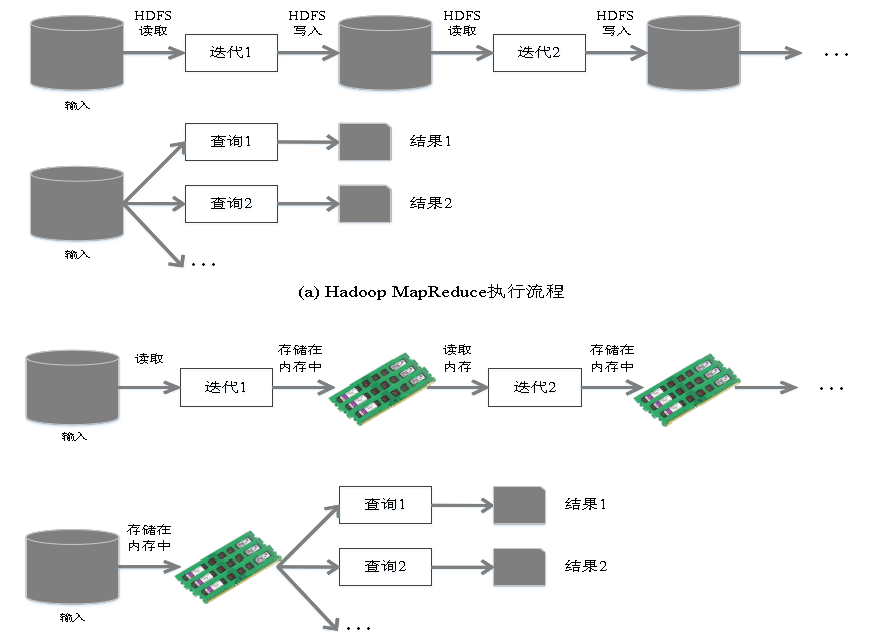
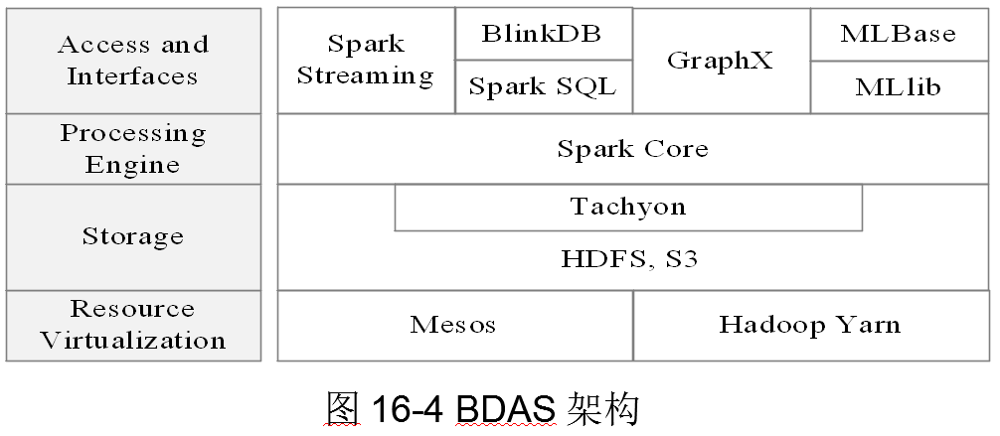

# Spark

> **作者：liy**

## Spark简介
- Spark 加州伯克利大学（UCBerkeley）AMP实验室 2009年开发

- 基于 内存计算 的大数据 并行计算框架，可用于构建大型的、低延迟的数据分析应用程序

- 2013年 Spark加入Apache

- Apache软件基金会最重要的三大分布式计算系统开源项目之一（Hadoop、Spark、Storm）

- Spark在2014年打破了Hadoop保持的基准排序纪录
> 1. Spark/206个节点/23分钟/100TB数据
> 2. Hadoop/2000个节点/72分钟/100TB数据
> 3. Spark用十分之一的计算资源，获得了比Hadoop快3倍的速度

## Spark主要特点
- 运行速度快：DAG执行引擎 支持循环数据流 与内存计算（比mapreduce一轮轮迭代方式快）
- 容易使用：支持使用Scala、Java、Python和R语言进行编程，可以通过Spark Shell进行交互式编程 
- 通用性：Spark提供了完整而强大的技术栈，包括是Sparkcore、SQL查询SparkSQL、流式计算SparkStream、机器学习Mllib和图算法组件
- 运行模式多样：可运行于独立的集群模式中，可运行于Hadoop中，也可运行于Amazon EC2等云环境中，并且可以访问HDFS、Cassandra、HBase、Hive等多种数据源

## Scala简介
Scala是一门现代的多范式编程语言，运行于Java平台（JVM，Java 虚拟机），并兼容现有的Java程序
### Scala的特性
- Scala具备强大的并发性，支持函数式编程，可以更好地支持分布式系统
- Scala语法简洁，能提供优雅的API
- Scala兼容Java，运行速度快，且能融合到Hadoop生态圈中 

- Scala是Spark的主要编程语言，但Spark还支持Java、Python、R作为编程语言
- Scala的优势是提供了REPL（Read-Eval-Print Loop，交互式解释器），提高程序开发效率

## Spark与Hadoop的对比
### Hadoop存在如下一些缺点
- 表达能力有限
- 磁盘IO开销大
- 延迟高
> 1. 任务之间的衔接涉及IO开销
> 2. 在前一个任务执行完成之前，其他任务就无法开始，难以胜任复杂、多阶段的计算任务

### 相比于Hadoop MapReduce，Spark主要具有如下优点：
- Spark的计算模式也属于MapReduce，但不局限于Map和Reduce操作，提供了多种数据集操作类型，编程模型比Hadoop MapReduce更灵活
- Spark提供内存计算，可将中间结果放到内存中，对于迭代运算效率更高
- Spark基于DAG的任务调度执行机制，要优于Hadoop MapReduce的迭代执行机制

### Hadoop与Spark对比图 

## Spark生态系统
### 在实际应用中，大数据处理主要包括以下三个类型：
- 复杂的批量数据处理：通常时间跨度在数十分钟到数小时之间
- 基于历史数据的交互式查询：通常时间跨度在数十秒到数分钟之间
- 基于实时数据流的数据处理：通常时间跨度在数百毫秒到数秒之间

> 当同时存在以上三种场景时，就需要同时部署三种不同的软件
> 比如: MapReduce  /  Impala  /  Storm

### 这样做一些问题： 
- 不同场景之间输入输出数据无法做到无缝共享，要进行数据格式的转换
- 不同的软件需要不同的开发和维护团队，使用成本高
- 比较难以对同一个集群中的各个系统进行统一的资源协调和分配（yarn支持的计算框架不全）

### Spark的设计遵循“一个软件栈满足不同应用场景”，形成完整的生态系统
- 既能够提供内存计算框架，也可以支持SQL即席查询、实时流式计算、机器学习和图计算等
- Spark可以部署在资源管理器YARN之上，提供一站式的大数据解决方案
- Spark所提供的生态系统足以应对上述三种场景，即同时支持批处理、交互式查询和流数据处理

### Spark生态系统已经成为伯克利数据分析软件栈BDAS（Berkeley Data Analytics Stack）的重要组成部分

> Spark的生态系统主要包含了Spark Core、Spark SQL、Spark Streaming、MLLib和GraphX 等组件

